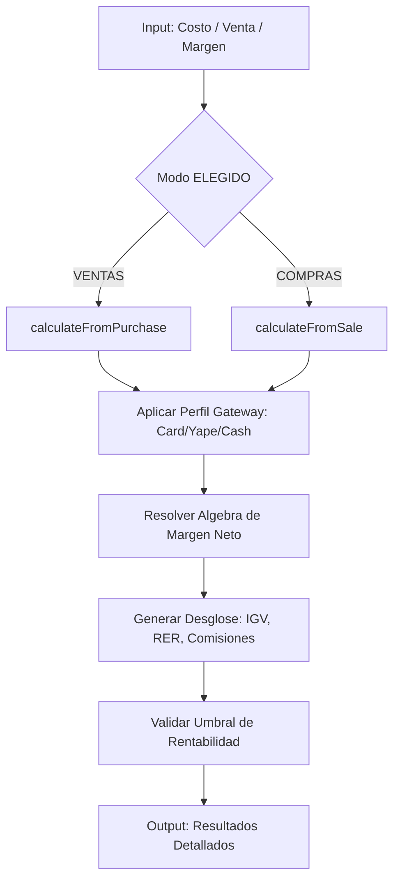

# Pricing Core Engine V4.3 - Technical Guide

Este motor financiero desacoplado gestiona la lógica de precios estratégica de Aura Store bajo el régimen RUC 20 (Perú).

## Flujo de Cálculo (Mermaid)



## Perfiles de Gateway
| Perfil | Comisión (%) | Fee Fijo (S/) | Descripción |
| :--- | :--- | :--- | :--- |
| **CARD** | 3.99% | S/ 1.00 | Mercado Pago Tarjetas (incl. IGV) |
| **YAPE** | 2.99% | S/ 0.00 | QR Dinámico / Pago con Yape |
| **CASH** | 0.00% | S/ 0.00 | Efectivo / Transferencia Directa |

## Fórmulas de Ingeniería

### 1. Cálculo de Venta (Directo)
Determina el precio que se debe cobrar en web para obtener un margen neto específico.

$$V = \frac{C + F(1 + IGV) + S}{\frac{1 - RER}{1 + IGV} - R(1 + IGV) - M}$$

Donde:
- **C**: Precio de costo.
- **F**: Fee Fijo del Gateway.
- **S**: Gastos de Envío.
- **R**: Tasa variable del Gateway.
- **M**: Margen Neto deseado.

### Ejemplo Numérico (V4.3)
- Costo: **S/ 100.00**
- Margen: **20%**
- Gateway: **Tarjeta (3.99% + 1.00)**
- Resultado Venta: **S/ 141.69** approx.

## Integración con Inventario V4
El motor expone funciones puras que pueden usarse en procesos de fondo (Silent Mode) para auditar inventario o sugerir precios masivos.

```javascript
import { calculateFromPurchase } from '@/core/pricing/pricingEngine';

// Ejemplo para actualización masiva de precios
const sugerido = calculateFromPurchase({ 
  compra: 150, 
  margen: 25, 
  method: 'YAPE' 
});
```
